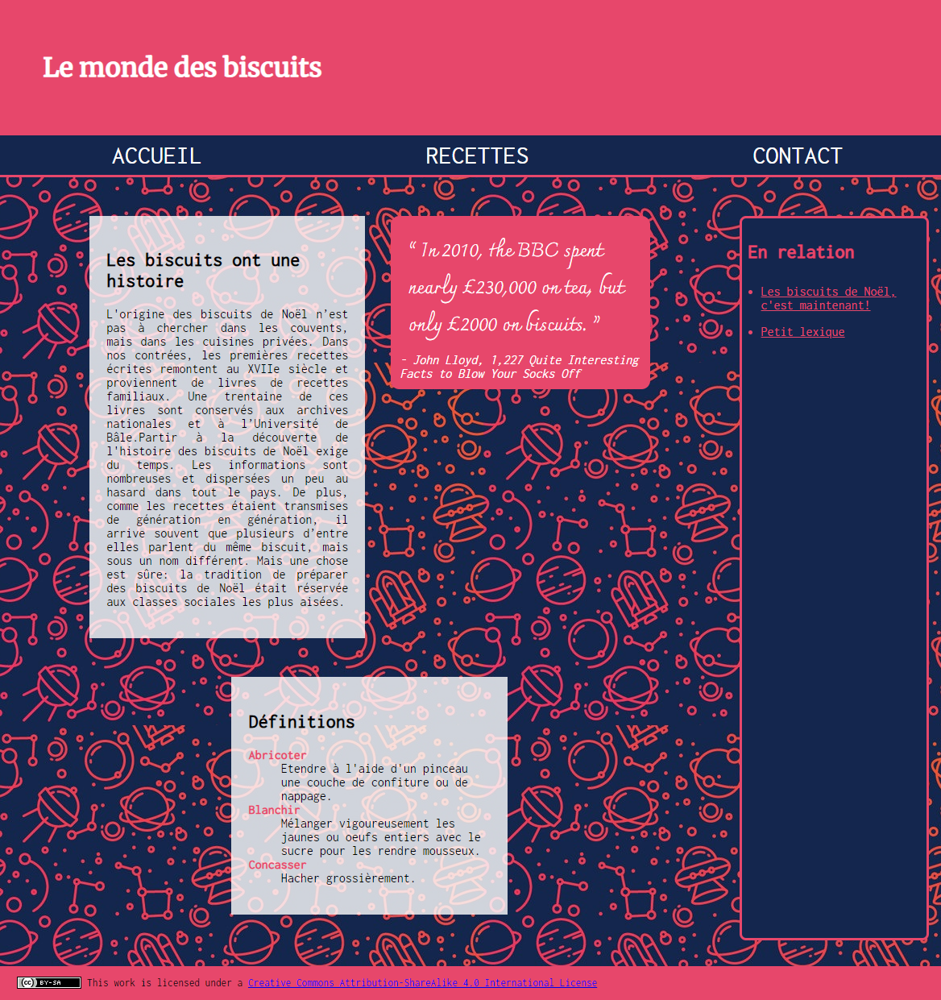

# Exercice: Biscuits Lite (CSS flexbox)

Ouvrir le projet dans [codesanbox.io](https://codesandbox.io/s/github/bfritscher/cours-html-exercices/tree/master/CSS_Flexbox_Biscuits_lite)

A l'aide des fichiers et informations fournies on vous demande de finir le site pour ressembler au <a href="#resultat">résultat voulut</a>.

Une partie du HTML et CSS sont données, à vous de compléter le CSS avec des insctructions Flexbox. Pour vous aider voici le <a href="#croquis">croquis</a> initial de la personne qui a commencé à programmer la page et quelques annotations :

- La barre de navigation principal comporte 3 liens href="#" avec les textes: Accueil, Recettes, Contact.
    **Ils sont écrit tel quelle, mais affiché en majuscule.**

- Quand la souris passe sur un lien la couleur de fond de celui-ci est la même que l'entête.

- On utilise le div.two_columns pour partager la page en deux colonnes de ratio 4/1. Il occupe lui-même tout l'espace disponible de la hauteur de la page qui n'est pas utilisé par l'entête ou le pied de page.

- Les elements à l'inétrieur de main occupent la place horizontalement s'il y a de la place, et sont centrés.

- L'aparté à une bordure de 3px et des bord arrondie de 8px.

<h2 id="croquis">Croquis</h2>

<h2 id="resultat">Résultat</h2>

Après avoir validé votre syntaxe HTML avec https://validator.w3.org/ et CSS avec https://jigsaw.w3.org/css-validator/ vous pouvez valider l'exercice sur https://html.bf0.ch/#biscuits_lite .
